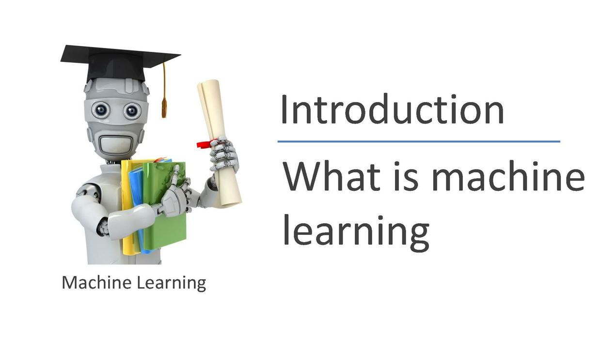
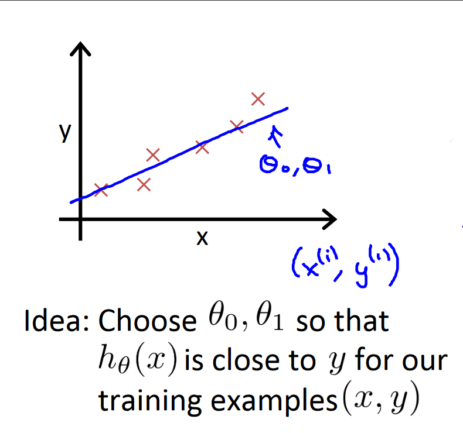
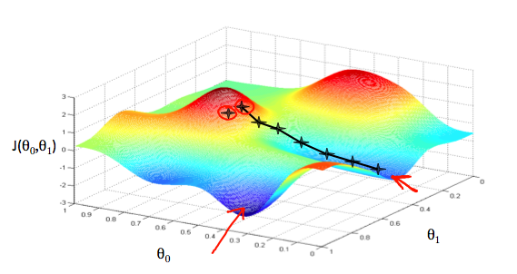
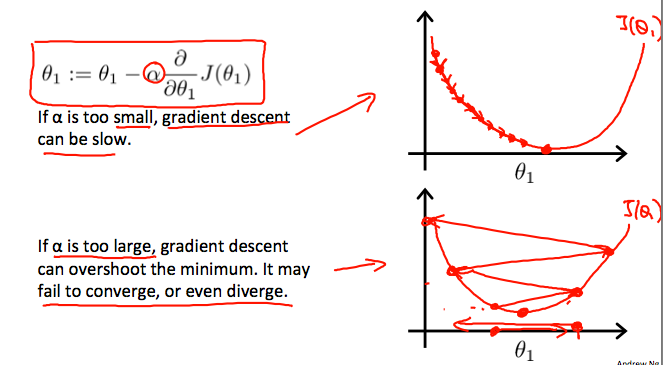

自学机器学习，我选择的是吴恩达在Coursera上的公开课**Machine Learning**，学了课程中的两个星期，发现讲得比较明白易懂，连微积分、矩阵都会补充一下基础知识。跟着这门课程，很多东西比较容易地就理解了。这几篇博客，我准备将学习过程中的笔记总结一下。



这次主要介绍一下机器学习的基础知识，线性回归模型，损失函数，梯度下降法。

1. 机器学习简单介绍
2. 
关于机器学习（Machine Learning）有很多不同的定义，课程里面采用的是 Tom Mitchell 的定义：

> A computer program is said to learn from experience E with respect to some class of tasks T and performance measure P, if its performance at tasks in T, as measured by P, improves with experience E
> 对于一个特定的任务T，一个机器从经验E中学习，使用P来衡量它在任务T中的表现，如果通过学习经验E，它的P提高了，那么就称之为机器学习

机器学习大体上分为两类：**有监督学习（Supervised Learning）**和**无监督学习（Unsupervised Learning）**。有监督学习可以分为分类（Classification）和回归（Regression）两类问题，无监督学习主要指聚类（Cluster）问题。分类问题是指给定一系列特征数据，通过这些特征数据来预测目标属于哪一类别，而回归则是根据这些特征数据来得到一个数值，分类用于需要预测的结果是离散的情况，而回归用于最终结果是连续的情况。举个例子，给出一套房子的一些特征数据如面积，卧室数等等，如果目标是预测这套房子的房价，这是一个连续的数值，那么就属于回归问题，如果目标是判断房价处于哪一个价格等级，由于价格等级是离散的一些等级，那么这就属于分类问题。

关于聚类问题，一个例子是谷歌新闻，比如你在谷歌新闻下面搜当天的新闻：“Gmail推出新功能”，那么你会看到一个“Gmail推出新功能”的大标题下面，聚合了很多来自不同媒体的相关报导，那么谷歌新闻是怎么把这些内容都归到一起的呢，就是通过聚类算法。事先并没有人告诉它应该怎么归类，它就是在大量的新闻中，使用聚类算法，进行自动的归类。

2. 线性回归
3. 
**线性回归（Linear Regression）**是一个很简单的回归算法，使用它我们可以快速地了解很多基础知识。首先看一个只有一个特征值的线性回归问题，给定以下数据：

|x|y|
|-|-|
|2104|460|
|1416|232|
|1534|315|
|852|178|
|...|...|

这些给定的数据也叫做数据集，我们把每组数据记作（$x^{(i)}$,$y^{(i)}$），一共有m组数据。我们的目标就是给出一个模型，用于根据新给定的x值预测y的值，对于线性回归，我们使用的模型是一个线性函数：

$$h_i(\theta) = \theta_0 + \theta_1x^{(i)}$$

这个模型也叫做假设（Hypothesis），其中$\theta_0$和$\theta_1$就是我们最终需要训练得到的参数（Parameter），所以我们就是想找到一组最优的$\theta_0$和$\theta_1$，使我们的假设最贴近数据集：



那么我们如何得到最优的$\theta_0$和$\theta_1$呢，我们将训练的目标转化为最小化下面这个函数：

$$J(\theta) = \frac 1{2m}\sum_{i=1}^m(h_i(\theta)-y^{(i)})^2$$

这个需要最小化的函数就叫做**损失函数（Cost Function）**，损失函数有很多种，上面用的这种叫做均方误差（Mean Square Error），可以看到，我们实际上就是在最小化我们的假设与训练集中实际的$y_i$的误差。至于最小化损失函数的方法，将会在下一部分介绍。

总结一下，通过一个最简单的线性回归的例子，我们介绍了以下的名词：

- Dataset 数据集：（$x^{(i)}$,$y^{(i)}$）
- Hypothesis 假设：$h_i(\theta) = \theta_0 + \theta_1x^{(i)}$
- Cost Function 损失函数：$J(\theta) = \frac 1{2m}\sum_{i=1}^m(h_i(\theta)-y^{(i)})^2$

3. 梯度下降法

好了，我们已经知道在线性回归问题中，我们的目标转化为了最小化损失函数，那么现在来介绍最小化损失函数$J(\theta)$的方法：**梯度下降法（Gradient Descent）**，这个算法不仅用于线性回归，其他的问题也可以用梯度下降法来最小化损失函数。

梯度下降法的思想是：先选定一个初始点$\theta_0$和$\theta_1$，但是这个初始点有可能是让损失函数$J(\theta)$取最小值的点，也有可能不是让损失函数$J(\theta)$取最小值的点，所以我们就不断地更新$\theta_0$和$\theta_1$的值，更新的时候按照下面的方法更新：

$$\theta_n = \theta_n-\alpha\frac{\partial J(\theta)}{\partial \theta_n}$$

需要注意的是更新的时候需要一次性算完之后全部更新，而不能在算$\theta_1$的时候使用已经更新之后的$\theta_0$代入$J(\theta)$。上面的算式就是梯度下降法。可以看到，如果取的$\theta_0$和$\theta_1$已经在最小值点（全局最小或者局部最小）上，那么每次更新的时候由于导数是零，所以$\theta_0$和$\theta_1$的值维持不变。而如果$\theta_0$和$\theta_1$没有处于最小值点上，那么在$\alpha$取值适当的情况下，每次更新$\theta_0$和$\theta_1$会让损失函数$J(\theta)$的取值都变得比更新之前更小。下面通过一个图来直观地感受一下梯度下降法：



对应每个不同的$\theta_0$和$\theta_1$，$J(\theta)$都有不同的取值，每次更新的时候$\theta_n$都沿着使$J(\theta)$下降最快的方向更新。如果参数$\theta_n$不止两个，方法也是一样的。

对于线性回归模型来说，由于我们已经得到了$J(\theta)$的表达式，我们可以将$J(\theta)$代入，求出偏导数，从而进一步化简这个式子:

$$\theta_n = \theta_n-\alpha\frac{1}{m}\sum_{i=1}^m(h_\theta(x_i)-y_i)$$

4. 学习率
5. 
在梯度下降法的更新公式中，有一个参数$\alpha$，它控制着每次更新的大小，也叫**学习率（Learning Rate）**，是手动设置的。需要注意的是，如果学习率设置得过小，那么每次更新只会下降很小的一段距离，想要达到最优解就会花费更多的步骤，所以运行的时间会大大增加；如果学习率设置得过大，那么有可能更新之后的$\theta_n$会使得$J(\theta)$直接跃过了最小值点，甚至变得比更新之前的值更大，像这样：



这样下去，损失函数会不断变大，永远也到不了最优解。

还有一点是，当我们向最小值点接近的时候，可以看到梯度也变小了，因此梯度下降法式子中的 $\alpha\frac{\partial J(\theta)}{\partial \theta_n}$ 也随之在变小，所以我们不需要随着训练次数的增加而逐渐减小学习率$\alpha$

5. 多元线性回归

之前讲的线性回归的例子里面，我们只用到了一个特征参数x来预测y的值，但是在实际应用中，很多时候我们会利用多个特征参数，比如如果我们想预测一个房子的价格，我们除了可以用面积这一个特征参数来预测价格之外，还可以利用年代，卧室数，客厅面积等等一些特征参数一起来预测价格，所以假设特征参数有n个，这个时候我们的数据集就变为：

$$(x^{(i)}_1,x^{(i)}_2,...,x^{(i)}_n,y^{(i)})$$

对比刚刚的线性回归来建立这个**多元线性回归（Multivariate linear regression）**的模型，可以得到：

- Hypothesis 假设：$h_i(\theta) = \theta_0 + \theta_1x^{(i)}_1+ \theta_2x^{(i)}_2+...+\theta_nx^{(i)}_n$
- Cost Function 损失函数：$J(\theta) = \frac 1{2m}\sum_{i=1}^m(h_i(\theta)-y^{(i)})^2$

6. 多项式回归

当然，只用线性的模型去拟合数据有很大的局限性，大部分数据都不是线性的，但是这个时候解决方法也很简单，只需要在线性模型的基础上稍加改进就可以使用简单的非线性模型来拟合数据。

从一个简单的例子开始，在线性回归中的那个只有一个特征参数的例子中，如果$y^{(i)}$和$x^{(i)}$的关系不是线性的，而是二次的关系，那么我们可以首先对数据集作一些处理，用$x'^{(i)} = x^{(i)2}$，然后去建立$y$与$x'$的模型，这样我们就用建立线性模型的方法处理了非线性的数据。不只是二次方的关系，更高次方或者其它非线性关系也可以这样处理。

7. 其他技巧

当我们有很多个特征参数时，这些特征的量程往往是不一样的，甚至差距很大，比如房子的面积可能是上百平方米，而卧室数则是个位数，如果不对数据作预先处理，在训练的时候可能会花费更多时间。因此我们需要做的就是将这些数据都处理到差不多的范围，比如-1 ~ 1这个范围，或者-5 ~ 5等等，一个常用的处理方法是**均值归一化处理（Mean Normalization）**：

$$x^{(i)} = \frac {x^{(i)}-u_i}{s_i}$$

其中$u_i$是指第i个特征参数（如房子面积）下的所有数据的平均值，$s_i$指第i个特征参数下的数据的极差，或者标准差。

第二个技巧是矩阵化（Vectorization），比如在多元线性回归中：

$$h_i(\theta) = \theta_0 + \theta_1x^{(i)}_1+ \theta_2x^{(i)}_2+...+\theta_nx^{(i)}_n$$

如果一个一个算再相加的话效率相对低下，更好的方法是使用矩阵，假设$x^{(i)}_0 = 1$，那么$h_i(\theta)$也可以使用以下方法计算：

$$h_i(\theta) = [\theta_0,\theta_1,...,\theta_n]*X^T$$

其中$X = [x^{(i)}_0,x^{(i)}_1,...,x^{(i)}_n]$

使用矩阵的好处是非常易于编程实现，课程中推荐了Octave，它的语法和MATLAB一样，但是是免费的，既可以直接在命令行中运行也可以编辑```.m```文件运行。使用这些语言实现矩阵运算十分方便。

目前为止，大体对线性回归的模型作了介绍，但是具体如何使用编程语言实现还没有讲解，我们的目标是求出模型中$\theta_i$的值，第一种方法，我们可以按照模型中的梯度下降法，写出每一步的循环，不断地更新$\theta_i$的值，直到损失函数下降到比较小的值，还有一种方法，就是实际上对模型进行数学运算之后，我们其实可以得到$\theta_i$的通解：

$$\Theta = (X^TX)^{-1}X^Ty$$

其中$\Theta$是$\theta_i$组成的向量，$y$是$y^{(i)}$组成的向量，$X$是所有特征值的所有数据组成的一个矩阵，上面的式子叫做 **Normal Equation**，是除了梯度下降法之外的另一种最小化损失函数的方法。当然，由于这个 Normal Equation 里面涉及到求逆矩阵，所以有时并不能得到好的结果。比如当你有很多个特征参数，但是给的数据集所提供的数据却远远少于特征参数的个数时，这时通解中的矩阵是没有逆矩阵的。下表比较了使用梯度下降法和直接使用通解的区别，我们需要根据实际情况来选择：

|Gradient Descent|Normal Equation|
|-|-|
|Need to choose alpha|No need to choose alpha|
|Needs many iterations|No need to iterate|
|$O (kn^2)$|$O (n^3)$, need to calculate inverse of $X^TX$|
|Works well when n is large|Slow if n is very large|
