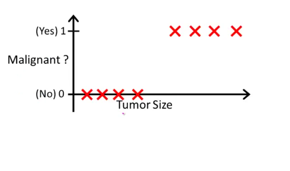
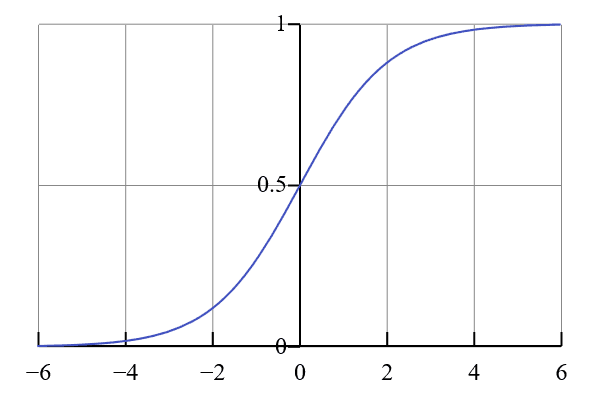
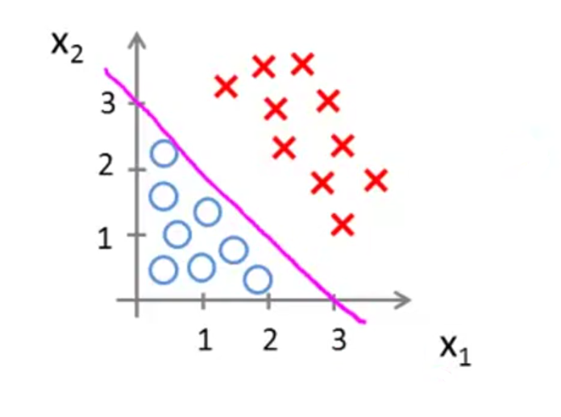
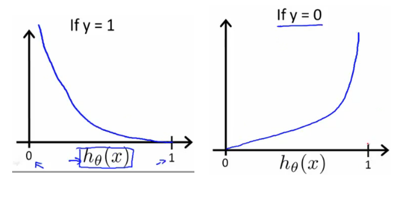
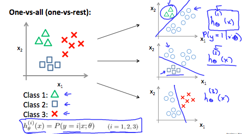

之前介绍了[线性回归模型](https://www.jianshu.com/p/258a12d263d0)，这个模型是用于处理回归问题，接下来介绍一下分类问题的处理。首先介绍二分类问题，举个例子，根据肿瘤大小判断一个肿瘤是良性还是恶性，这个时候对应的类别就是良性/恶性，我们可以将良性记为1，恶性记为0：



对于0-1分类问题，使用线性回归很多时候并不是一个好的办法，我们会得到一条尽可能匹配训练集的直线，但是这条直线大部分情况下是不能很好匹配的，并且会出现结果比0小或者比1大的情况，而在0-1分类问题中我们只有0和1两种结果。

### Logistic Regression（Logistic回归）
Logistic 回归是一种分类算法，得出的结果都在0到1之间，首先介绍Logistic回归用于处理二分类问题。同之前一样，我们先看一下它的假设函数（Hypothesis）：

线性回归的 Hypothesis 是$h(\theta)=\theta^Tx$，而 Logistic 回归的 Hypothesis 是$h(\theta)=g(\theta^Tx)$，其中$g(z)=\frac{1}{1+e^{-z}}$叫做**Logistic 函数**或者**Sigmoid 函数**，这个函数的值域是0到1，因此得到的假设函数的值域也是0到1，Sigmoid 函数的图像：


使用这个假设函数，我们就能够对给定的输入数据得到一个位于区间$(0,1)$的输出结果，但是在二分类问题中，我们想要的结果只能是0或者1中的其中一个，并不包括0到1之间的小数，那么$h(\theta)$的意义是什么呢。这时我们可以用$h(\theta)$表示在给定的参数$\theta$和输入数据$x$下，$y$取1的概率，即：

$$h(\theta)=P(y=1|x,\theta)$$

比如上面肿瘤的例子中，给定了肿瘤大小，确定了一组参数$\theta$，通过$h(\theta)$的公式计算出了$h(\theta)=0.7$，那么意义就是说这个肿瘤是恶性肿瘤的概率是0.7。在实际应用中，我们可以将$h(\theta)>0.5$的情况对应分类1，将$h(\theta)<0.5$的情况对应分类0。

介绍完了 Logistic 回归的假设函数再来简单介绍一下**决策边界（Decision Boundary）**的概念，在 Logistic 回归中，可以看到我们的决策边界是$h(\theta)=0.5$，代进$h(\theta)$的公式其实就是$\theta^Tx=0$。如果我们用一个具体的例子，就可以看到，决策边界其实表现在可视化的图上面就是一条线，不一定是直线，这条线区分开了我们要判断的两个类别：



图中两个类别用叉和圆圈表示，而决策边界就是将$\theta^Tx=0$展开之后得到的式子。比如上图的$\theta^Tx$对应$-3+x_1+x_2$，那么决策边界就是$-3+x_1+x_2=0$，也就是图中的粉色的直线。

### Logistic回归的损失函数
和线性回归模型中的方法一样，想要找到假设函数中最优的参数$\theta$，我们的方法是建立一个损失函数，把优化目标变为最小化损失函数。对于线性回归，我们使用的损失函数是 Square cost function，但是对于 Logistic 回归，则不能使用 square cost function 作为损失函数，因为只有凸函数（Convex Function）才好下降到最小值，而 Logistic 回归中的 Sigmoid 函数是一个非凸函数（Non-convex Function）。所以我们需要建立一个新的损失函数，让这个新的损失函数是凸函数。

这个新的损失函数为：

$$\begin{align*} J(\theta)=\frac{1}{m}[\sum_{i=1}^m-\log(h_{\theta}(x))] &\;\;\;\;, y=1 \newline\ J(\theta)=\frac{1}{m}[\sum_{i=1}^m-\log(1-h_{\theta}(x))] &\;\;\;\;, y=0 \end{align*}$$

根据这个定义，画出它的图像为：



可以看到，这个新的损失函数是符合损失函数的性质的。对于$y=1$的情况来说，如果$h(\theta)=1$，那么预测准确，cost 就是0，如图，如果$h(\theta)=0$，预测不准确，cost 趋近无穷，对于$y=0$的情况也一样。一种简化版的损失函数可以写成：

$$J(\theta)=-\frac{1}{m}[\sum_{i=1}^my^{(i)}\log(h(x^{(i)}))+(1-y^{(i)})\log(1-h(x^{(i)}))]$$

### 最小化 Logistic 回归的损失函数

接下来我们需要最小化 Logistic 回归的损失函数，第一种方法就是像线性回归模型中一样，使用梯度下降法，那么 Logistic 回归中的梯度下降法的公式和线性回归模型中是一样的，唯一不一样的就是假设函数$h(\theta)$需要改成 Logistic 回归的假设函数：

$$\begin{align*}& Repeat \; \lbrace \newline & \; \theta_j := \theta_j - \alpha \dfrac{\partial}{\partial \theta_j}J(\theta) \newline & \rbrace\end{align*}$$

除了使用梯度下降法最小化损失函数之外，其实还有很多种最小化的方法，比如"Conjugate gradient", "BFGS", 和 "L-BFGS"，这些都是更加快速但是更复杂的优化算法。

这里介绍另一种方法，就是使用 Octave 这类编程语言中自带的最小化函数，在 Octave 中，我们可以使用 ```fminfunc()``` 函数，只需要给出Cost function 以及参数的初始取值，```fminfunc()``` 函数就可以自动帮我们最小化 Cost function，代码示例：

先定义 cost function：

```
function [jVal, gradient] = costFunction(theta)
  jVal = [...code to compute J(theta)...];
  gradient = [...code to compute derivative of J(theta)...];
end
```

然后使用Octave自带的```fminfunc()```函数进行优化：

```
options = optimset('GradObj', 'on', 'MaxIter', 100);
initialTheta = zeros(2,1);
   [optTheta, functionVal, exitFlag] = fminunc(@costFunction, initialTheta, options);
```

### 在多分类问题中使用 Logistic 回归

如果现在不止有两类需要分类，而是有A,B,C,D...多个类别需要分类，这个时候可以使用一对多（One-vs-all）的分类方法，对于每一个类别比如A类别，都使用 Logistic 回归创建一个单独的分类器，这时将这个特定的类别A记为1，其余所有类别B,C,D...都记为0，相当于又回到了二分类中，对于n个类别，一共需要创建n个不同的分类器，第i个分类器的假设记为$h^{(i)}_{\theta}(x)$，得到n个分类器之后，最后判断的时候先使用给定的数据算出所有的$h^{(i)}_{\theta}(x)$，那么每个$h^{(i)}_{\theta}(x)$其实就代表了给定数据取类别i的概率，然后看哪个$h^{(i)}_{\theta}(x)$最大，那么就属于哪一类。

比如对于下图例子中的多分类问题，一共有三个类别，我们分别对三角形代表的类别、方框代表的类别和叉代表的类别建立一个分类器，一共得到三个假设函数，分类的时候将三个假设函数的值计算出来，哪个大就属于哪个类别：



### 欠拟合和过拟合

接下来介绍一个机器学习中很常用的概念：欠拟合和过拟合

- **欠拟合（underfitting）** 是指得到的模型即使是在训练集上也不能很好地进行预测，更不用说将这个模型用于实际的预测了
- **过拟合（overfitting）** 是指模型太过完美地匹配了训练集的数据，但是却不能很好的泛化，对于新数据的预测能力依然不强

通过下图举个例子，第一张图存在欠拟合的问题，得到的模型连训练集上的点都没有很好的预测，第二张图中的模型比较好，第三章图存在过拟合的问题，模型精准地经过了每一个点，但是却产生了很多复杂的弯曲：


所以出现欠拟合和过拟合都是不好的情况，对于过拟合的情况，课程中介绍了两种处理的方法：

- 减少特征的数量：可以手动去除一些特征，也可以使用自动选择特征的算法
- 正则化（Regularization）：保留所有的特征，但是减小$\theta_j$的值，用于所有特征都对预测结果有微小贡献的时候，具体的说，使用正则化方法之后的损失函数变为：

$$J(\theta)=\frac{1}{2m}[\sum_{i=1}^m(h_{\theta}(x^{(i)})-y^{(i)})^2+\lambda\sum_{j=1}^n\theta_j^2]$$

其中$\lambda$叫做正则化参数，作用是控制$\theta_j$，让其减小，注意减小的$\theta_j$是从1开始，$\theta_0$不受影响。使用正则化的方法，我们可以减轻过拟合问题，使上图中图三的曲线向图二变化。但是，如果正则化参数$\lambda$选取得过大，会导致曲线继续变平滑，从而导致欠拟合

### 线性回归与 Logistic 回归中的正则化

- 线性回归中的正则化

在线性回归模型中，我们曾经使用了梯度下降法和 Normal Equation 两种方法来最小化损失函数。在正则化之后，损失函数有所变化，因此无论是使用梯度下降法还是Normal Equation我们的公式都有所变化。对于梯度下降法，$\theta_j$的更新公式变为：

$$\theta_j=\theta_j(1-\alpha\frac{\lambda}{m})-\alpha\frac{1}{m}\sum_{i=1}^m(h_{\theta}(x^{(i)})-y^{(i)})x_j^{(i)}$$
对于 Normal Equation，$\theta$的计算方法变为：

$$\begin{align*}& \theta = \left( X^TX + \lambda \cdot L \right)^{-1} X^Ty \newline& \text{where}\ \ L = \begin{bmatrix} 0 & & & & \newline & 1 & & & \newline & & 1 & & \newline & & & \ddots & \newline & & & & 1 \newline\end{bmatrix}\end{align*}$$

- Logistic回归中的正则化

和线性回归相似，Logistic 回归中的损失函数变为：

$$J(\theta)=-\frac{1}{m}\sum^m_{i=1}[y^{(i)}log(h_{\theta}(x^{(i)}))+(1-y^{(i)})log(1-h_{\theta}(x^{(i)}))]+\frac{\lambda}{2m}\sum_{j=1}^n\theta_j^2$$
