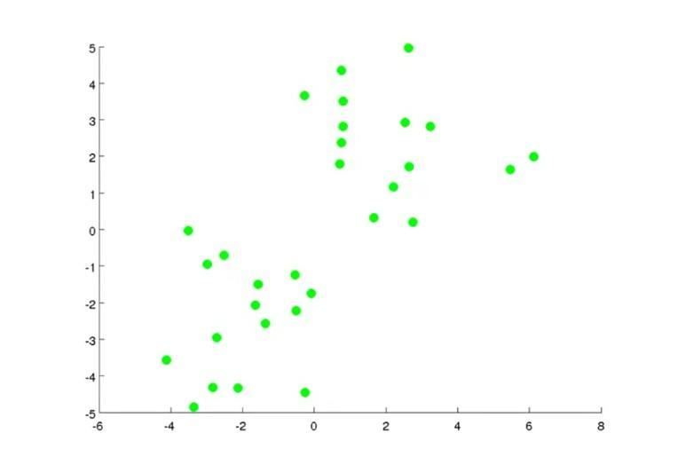
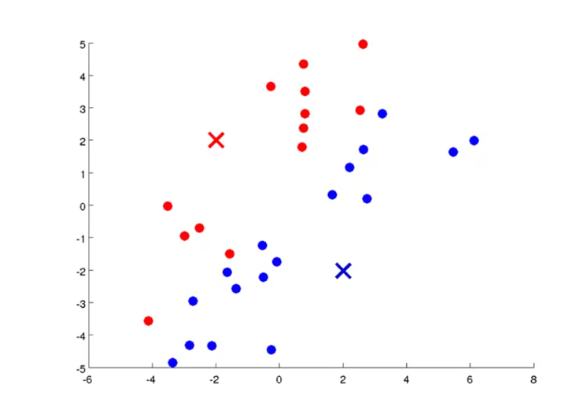
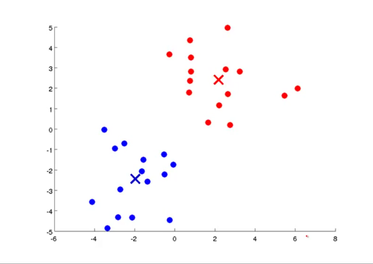
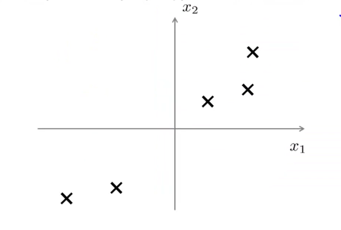
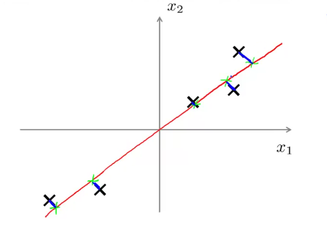
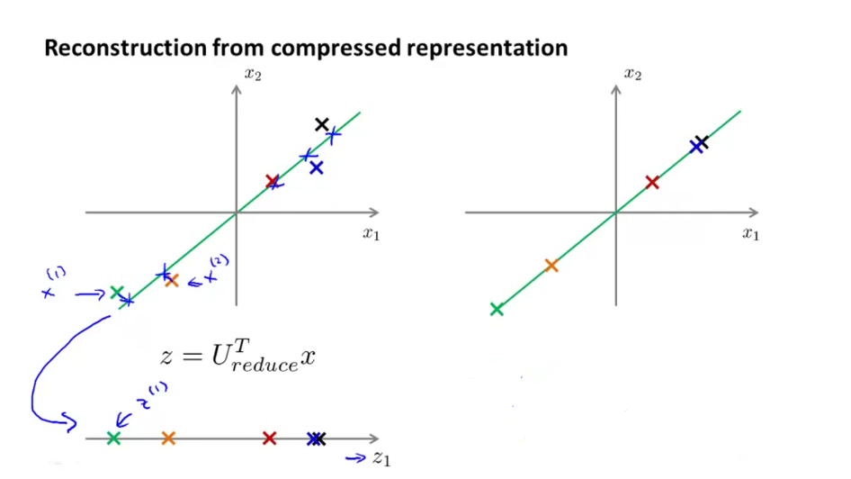

之前介绍了监督学习的一些算法：
- [线性回归](https://www.jianshu.com/p/258a12d263d0)
- [Logistic 回归](https://www.jianshu.com/p/d5491293bcaf)
- [神经网络模型](https://www.jianshu.com/p/0c5ad8a172d1)
- [支持向量机](https://www.jianshu.com/p/97dbe02c5797)

这篇文章介绍一下无监督学习的一些算法：K均值聚类算法，主成分分析法，以及异常检测

### K均值算法（K-means）

K均值是用来解决**聚类** 问题的一种算法。先简单看一下聚类问题，假设你有一些没有标签的数据，现在你想要将这些数据分组，假设你想要将这些数据分成两类，如下图：



K均值聚类算法中的K指的就是你想生成K个聚类，因此在这个例子中K=2。使用K均值聚类算法，首先，随机初始化K个数据点作为**聚类中心（Cluster Centroid）**，然后，对所有的数据进行标注，对于每个数据，它与哪个聚类中心的**距离**最近就将其标注为哪个类，这里所说的距离的计算方法是：

$$\sqrt{\sum_{i=1}^n(x_i-x'_i)^2}$$

即这个数据的所有特征值与聚类中心的相应特征值之差的平方求和再开根号

标注完每个数据之后，得到这样的结果：



接下来，对每个聚类，计算这个聚类中的所有数据点的均值，然后更新聚类中心，将聚类中心移动到均值点处。接下来重复以上的步骤：

- 对于每个数据点，计算与其距离最近的聚类中心，然后为其分配一个聚类
- 计算每个聚类的均值，将聚类中心更新到均值处

最终我们就能得到：



类似于监督学习中的算法，K均值算法同样有优化目标，其目标是最小化数据点与对应聚类中心距离的平方之和，优化的实现方法就是每次将聚类中心移动到选取数据的均值点处（这里省去了数学证明）

在随机初始化的时候，我们需要随机选择K个聚类中心，一种方法就是在给定的数据点中随机选取K个数据点，将这K个数据点作为聚类中心

### 主成分分析法（Principal Component Analysis，PCA）

主成分分析法是用于**降维（Dimensionality Reduction）**的一种算法，首先看一下降维问题，降维有很多应用，比如：

- 数据压缩：将n维的数据降维至m维的数据，要求m远小于n，且降维后的数据能够反映原数据的特征
- 数据可视化：想要将数据绘制在图像上，需要数据是2维或者3维的，因此需要用到降维

解决降维问题，最常用的算法就是主成分分析法，主成分分析法可以将n维的数据投影到k维并且要求最小化**投影误差（Projection Error）**（即投影前后的点的距离），先直观的通过一个例子看一下主成分分析法如何将2维数据投影到1维：



上图给出了一些二维的数据，要将其投影到一维并最小化投影误差，就是要找一条直线，将这些点投影到直线上，并且使得投影前后的点的距离（或者说这些点到这条投影直线的距离）最小化：



对于三维的数据也是一样，就是找一个二维的平面使得投影误差最小。从图中也可以直观的看出主成分分析法和线性回归模型的区别，首先就是优化目标不同，前者优化的是点到直线的距离，后者优化的是y值之差；其次是目的不同，前者是降维，后者是根据特征值预测y的值

接下来看一下主成分分析法的具体算法：

1. 首先需要对数据进行预处理，这个步骤和监督学习中使用的均值归一化处理（Mean Normalization）是一样的，目的是将所有数据处理到差不多相同的范围：

$$x^{(i)} = \frac {x^{(i)}-u_i}{s_i}$$

其中$u_i$是指第i个特征参数下的所有数据的平均值，$s_i$指第i个特征参数下的数据的极差，或者标准差。

2. 接下来计算**协方差矩阵（Covariance matrix）**$\Sigma$（Sigma），计算方法是：

$$\Sigma=\frac{1}{m}\sum_{i=1}^n(x^{(i)})(x^{(i)})^T$$

其中$(x^{(i)})$是一个$n*1$的矩阵

3. 计算Sigma的**特征向量（Eigenvectors）**：使用Octave或者MATLAB自带的函数```[U,S,V] = svd(Sigma)```，```svd```即**奇异值分解（Singular Value Decomposition）**。我们需要的就是输出中的U矩阵，U也是一个$n*n$的矩阵，我们从这个矩阵中取前k列的内容，得到一个$n*k$大小的矩阵，记为$U_{reduce}$

4. 最后计算$z=U_{reduce}^Tx$，得到的$z$就是一个$k*1$即k维的矩阵，也就是最终将数据从n维降到了k维

那么如何通过压缩之后的低维度数据重构之前的n维数据呢，这里可以用以下方法来近似还原之前的数据：

$$x_{approx}=U_{reduce}z$$

还原之后的数据和原始的数据有下面的变化（是原来数据的投影）：



还有一个问题是如何确定主成分的数量k，也就是将数据从n维压缩到k维的k值如何确定。在使用```[U,S,V] = svd(Sigma)```时，我们还得到了$S$矩阵，这是一个$n*n$的对角矩阵，记它的对角线上的元素是$S_{ii}$，那么选取k值的算法就是：k从1开始，不断增大，直到满足：

$$1-\frac{\sum_{i=1}^kS_{ii}}{\sum_{i=1}^nS_{ii}}\le0.01$$

式子右侧的0.01也可以取成0.05等其他值，代表了平方投影的误差。

### 异常检测（Anomaly Detection）

异常检测的问题就是判断某个数据在给定的数据中是否属于异常值，比如判断生产出的产品是否合格，根据记录判断信用卡的支付行为是否是盗刷等等

那么我们的第一感觉是解决异常检测的问题也可以用监督学习的方法来做，将数据分为正常和异常两个类别，标记好数据集，然后使用监督学习算法训练一个二元分类器，问题解决。

但是仔细想想，二元分类在处理异常检测问题上可能并没有想象中的效果。什么是异常，就是除了正常的数据以外的都要检测为异常，比如在一个具体例子中，假设正常的数据就是各种房子，那么除了房子的数据都是异常的，可能是车，可能是人，可能是书。。。所以异常所包含的范围太大了，根本就不能简单的将异常视为一个类别，更不可能将异常的所有的数据都收集起来标记好。除此之外，还有一个原因就是在实际生活中，异常的数据很难收集。因此，我们不能使用分类算法来解决异常检测问题

要了解异常检测的算法，首先需要知道**正态分布（Normal Distribution）**，又名高斯分布（Gaussian distribution），如果x服从正态分布，那么x的概率密度函数就是：

$$f(x)=\frac{1}{\sqrt{2\pi}\sigma}exp(-\frac{(x-\mu)^2}{2\sigma^2})$$

记为$N(\mu,\sigma^2)$

异常检测的算法就是，先选出特征$x_j$，假设你拥有的数据集里面已经有了${x^{(1)},x^{(2)}}...x^{(m)}$这些例子，那么对每个特征$x_j$，利用这些例子计算出这个特征的正态分布的参数，计算方法如下：

$$\mu_j=\frac{1}{m}\sum_{i=1}^mx_j^{(i)}$$
$$\sigma_j^2=\frac{1}{m}\sum_{i=1}^m(x_j^{(i)}-u_j)^2$$

接下来，当你拿到一个新的例子$x$的时候，计算它的概率$p(x)$：

$$p(x)=\prod_{j=1}^np(x_j;u_j,\sigma_j^2)=\prod_{j=1}^n\frac{1}{\sqrt{2\pi}\sigma_j}exp(-\frac{(x_j-\mu_j)^2}{2\sigma_j^2})$$

如果这个概率$p(x)<\epsilon$，那么就可以认为这个例子$x$是异常值，比如我们可以取$\epsilon=0.02$，那么当$p(x)<0.02$的时候，就可以认为是异常数据
